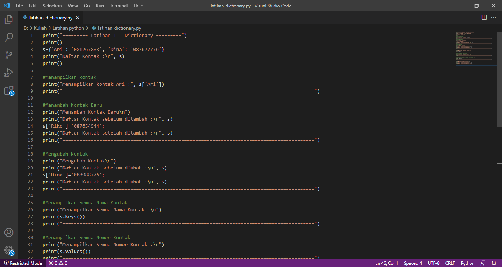

# Pratikum 5 - Dictionary

## Latihan Dictionary

**Dictionary** adalah tipe data pada python yang berfungsi untuk menyimpan kumpulan data/nilai dengan pendekatan _key-value_. Setiap _key_ dipisahkan dari value-nya oleh titik dua (:), sedangkan _item_ dipisahkan oleh koma, dan semuanya tertutup dalam kurung kurawal {}.

Dictionary sendiri memiliki dua buah komponen inti:
1.	**Key** merupakan nama atribut suatu item pada dictionary.
2.	**Value** adalah nilai yang disimpan pada suatu atribut.

### Program



![img] screenshot/lat1-1.png

### Penjelasan

1. Membuat dictionary daftar kontak.
	```python
	s={'Ari': '081267888', 'Dina': '087677776'}
	```
2. Untuk menampilkan salah satu kontak, gunakan `s['Ari']`. **s** adalah variable dictionary, sedangkan `['Ari']` adalah keys dari sebuah dictionary.
```python
	print("Menampilkan kontak Ari :", s['Ari'])
```
3. Jika ingin menambahkan kontak baru gunakan `variable_dictionary['keys']=value;`. 
	```python
	s['Riko']='087654544';
	```
4. Untuk mengubah kontak yang lama dengan yang baru, gunakan `variable_dictionary['keys']=value;`. Disini saya akan  mengubah valuenya yang semula `'Dina': '087677776'` menjadi `'Dina': '088988776'`.

	```python
	s['Dina']='088988776';
    ```
5. Untuk menampilkan semua nama kontak, gunakan `keys()`.
	```python
	print(s.keys())
	```
6. Jika ingin menampilkan semua nomor kontak, gunakan `values()`.
	```pyhton
	print(s.values())
	```
7. Untuk menampilkan daftar kontak beserta nomor teleponnya, gunakan `items()`.
	```pyhton
	print(s.items())
	```
8. Untuk menghapus salah satu kontak, gunakan statement `del variable_dictionary[keys];`.
	```python
	del s['Dina'];
	```
### Output

![img] screenshoot/
![img] screenshoot/

## Tugas Pratikum 5

